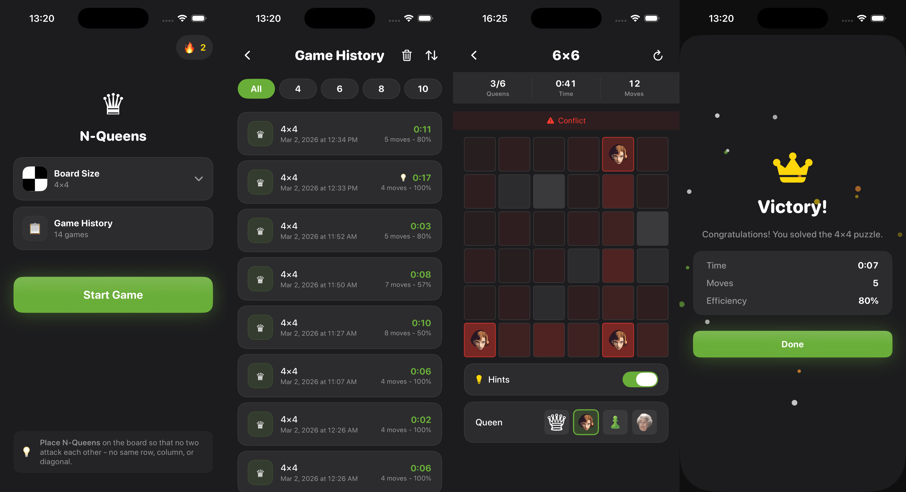

# NQueens

A SwiftUI app for the N-Queens puzzle: place N queens on an N×N board so that no two attack each other.

## Screenshots & Video

| Screenshot | Video |
|------------|-------|
|  | <video width="630" height="300" src="https://github.com/user-attachments/assets/20ff46a8-afba-4d8a-b25f-40574c81be70"></video> |

## Features

- **Variable board sizes** — Choose from 4×4, 6×6, 8×8, or 10×10 boards
- **Real-time conflict detection** — Conflicting queens and attack lines are highlighted
- **Hints** — Suggested placements to help you progress
- **Streaks** — Consecutive days played; track your consistency on the home screen
- **Game history** — Personal history with move count, duration, and persistent storage
- **Queen styles** — Multiple visual styles for the queen piece
- **Liquid Glass icons** — Modern iOS 26 Liquid Glass design for icons and UI
- **Animations** — Smooth queen placement and victory confetti celebration
- **Haptic feedback** — Tactile responses for placements and key actions

## How to test, build & run

**Xcode:** Open `NQueens.xcodeproj`, select the **NQueens** scheme, then **⌘R** (run), **⌘B** (build), or **⌘U** (tests). 

**Command line:**

```bash
xcodebuild -project NQueens.xcodeproj -scheme NQueens -destination 'platform=iOS Simulator,name=iPhone 16' build
xcodebuild -project NQueens.xcodeproj -scheme NQueens -destination 'platform=iOS Simulator,name=iPhone 16' test
```

**Requirements:** Xcode 26.x, Swift 6.x. Platforms: iOS.

---

## Architecture


### Summary

| Area | Choice | Rationale |
|------|--------|-----------|
| Pattern | MVVM + Coordinator | ViewModels for screen logic; Coordinators for flow and navigation |
| State | State-driven (like TCA): state in ViewModels and coordinator | Single source of truth; predictable updates, fits SwiftUI |
| DI | Single `AppDependencies` class, protocol-based services | Simple, explicit, testable without extra frameworks |
| Navigation | Coordinator with `FlowCoordinator` + delegate from ViewModels | Clear separation of flow and UI state; easy to test ViewModels |
| Structure | Features + Core + DesignSystem + Services | Easy to find code and scale by feature |
| Tests | XCTest + mocks implementing service/coordinator protocols | Fast, deterministic unit tests without UI or real I/O |

### High-level structure

- **App entry** — `NQueensApp` creates an `AppDependencies` container and passes it into `AppCoordinatorView`, which hosts the main UI via `HomeCoordinatorView`.

- **Feature-based layout** — Code is grouped by feature under `Features/Main/` (Home, Game, BoardSheet, GameHistory, WinModal). Each feature typically has a View, ViewModel, and optional subviews. Shared UI lives in `DesignSystem`; app-wide wiring in `Core` and `App`; domain and persistence in `Services`.

- **Scalability** — Next to the Home flow you can add more top-level modules (e.g. Settings, Profile) and plug them into a TabBar or another root switcher; each module gets its own coordinator. The same `AppDependencies` can feed all of them. The codebase can be split into Swift Package Manager modules (e.g. one package per feature or shared Core/DesignSystem/Services) for clearer boundaries and reuse.

### Core

App-wide infrastructure: **navigation** (`FlowCoordinator`, `ViewBind` for binding coordinator state to SwiftUI), **haptics** (`TapticEngine`), **DI** (`AppDependencies` container that provides service instances to coordinators and ViewModels).

### Design system

Shared look and behaviour: **tokens** (`ColorToken`, `TextToken`, `LayoutToken`) for colours, typography, spacing; **components** (e.g. `PrimaryButton`, `SelectorSheetView`); **view extensions** (`View+CardStyle`, `View+ClipRounded`, `View+FrameSquared`) for consistent layout and styling. `TapticEngine` is used for haptic feedback where it improves UX.

### Services

Protocol-based, injected via `AppDependencies`:

- **SettingsService** (`ISettingsService`) — Board size and queen style; persists to UserDefaults. Exposes `availableSizes`, `boardSize`, `queenStyle`, `updateBoardSize`, `updateQueenStyle`.
- **GameHistoryService** (`IGameHistoryService`) — List of finished games and streak count; persists history. Provides `games`, `gamesCount`, `streakCount`, `addGame`, `clearAllGames`.
- **GameValidationService** (`IGameValidationService`) — N-Queens rules: `conflictLines` / `conflictPositions` (cells under attack), `hintPositions` (suggested moves), `isWon(placements, boardSize)`.

### Dependency injection

- **Lightweight DI container** — `AppDependencies` holds lazy instances of `ISettingsService`, `IGameHistoryService`, and `IGameValidationService`. No third-party DI framework; for larger apps, a compile-time (e.g. Needle) or runtime (e.g. Swinject) framework could be considered.

- **Protocol-based services** — ViewModels and coordinators depend on protocols; tests inject mocks (`MockSettingsService`, `MockGameHistoryService`, etc.) without touching real implementations.

### Navigation and coordination

- **Coordinator pattern** — `FlowCoordinator<Destination, Sheet>` holds navigation `path` (stack) and `sheet` (presented sheet), with `push`/`pop`/`popToRoot` and `present`/`dismiss`. `HomeCoordinator` defines concrete destinations (game, game history) and sheets (board size, win modal), creates and caches ViewModels, and reacts to user flow (back, restart, play again).

- **Delegate from ViewModels** — ViewModels receive `HomeCoordinatorDelegate` and call `handle(_ action)` for navigation; they do not hold references to views or coordinators. Navigation logic stays in one place; ViewModels stay testable.

### ViewModels and state

- **Observable ViewModels** — `@Observable`, hold view state and derived data. Actions are grouped in `ViewModel+Action` extensions. ViewModels get services and the coordinator delegate in `init`; they do not create child ViewModels (the coordinator does).

- **ViewModel caching** — `HomeCoordinator` caches `GameViewModel` per game mode and `GameHistoryViewModel` so that returning from a screen or dismissing a sheet does not reset state unnecessarily.

### Testing

- **Unit tests** — `NQueensTests` contains tests for ViewModels (`HomeViewModelTests`, `GameViewModelTests`, `GameHistoryViewModelTests`) and for the validation service (`GameValidationServiceTests`). Tests use mocks from `TestDoubles.swift` and construct the system under test with these dependencies; no UI or coordinator is instantiated.

- **Design** — Same protocol interfaces in production and tests; only implementations (real vs mock) differ. Coordinators are not mocked; a no-op or recording delegate is used to assert expected actions.
